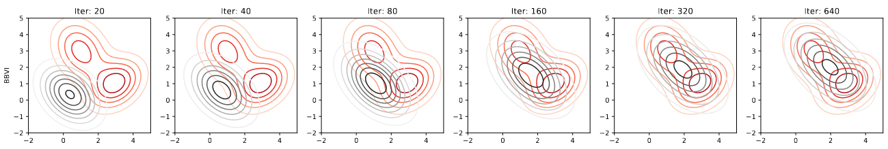

title: 采样与生成（2）：基于模型的变分推断
description: 记录 Model-based Variational Inference 的一些公式推理过程。
tags:
- 机器学习
- 贝叶斯学习
- 变分推断
---

## 变分推断（Variational Inference）
在贝叶斯学习、变分自编码器、扩散模型等领域的文献中经常能看到诸如变分推断（Variational Inference）、ELBO（Evidence Lower BOund）等字眼。本文尝试从源头开始一步步推理，详细解释VI和ELBO的来源以及推理过程。

## 问题设定
变分推断常被用来求解贝叶斯学习中的采样问题，这类问题针对一个给定的复杂目标分布$\nu(x)$，讨论如何高效地产生符合这个分布的样本点。怎么理解这个问题呢？比如对于简单的高斯分布或者是迪利克雷分布，可以简单地调用编程语言的一个函数生成样本点，但是对于一个general的分布，假设我们只知道该分布的概率密度函数及其梯度，如何产生样本点？这个目标分布通常有以下特点：

* 分布$\nu(x)$可能是未归一化的，其积分不是1，存在一个未知的归一化常数。
* 分布$\nu(x)$的维数可能相对比较高，10^1~10^5等等。
* 分布$\nu(x)$的最大值和最小值是未知的。
* 分布$\nu(x)$的形式非常复杂，无法写出概率密度函数的数学式，但是可以求概率密度函数和梯度（多层神经网络建模的分布通常都是这样的）。

变分推断的思路是，找一个简单分布（可以方便采样得到样本点的），使其尽可能接近目标分布。

抽象地总结，VI求解的问题可以被定义为：
$$
\min_{q} \text{KL}(q \| p), \tag{1}
$$
其中$q$是那个“简单”分布，这里为了和论文、网上的各种教程的符号统一，将目标分布定义为$p$。使用KL散度是“经典选择”，后续公式推导也会看到KL散度的结构对化简的重要性。

## 变分推断概述
通常情况下，简单分布$q$是参数化的，比如对于一个多元高斯分布来说，这个参数化就是它的均值和协方差矩阵，前者决定了这个高斯分布的“位置”，后者决定了这个高斯分布的“大小”。这里我们不讨论在共轭先验情况下变分推断问题的闭解（我也没研究过，现在很少看到这种特殊情况的解法了）。变分推断要做的事情是，优化$q$的参数（高斯分布情况下就是均值和协方差矩阵），使该高斯分布尽可能接近目标分布。

这里我用论文里的截图展示这个过程，这是一个2维的变分推断问题，其中红色表示目标分布，灰色表示待优化的分布。可以看到随着优化过程的进行，优化分布逐渐接近目标分布。

> The equivalence between Stein variational gradient descent and black-box variational inference

## 变分推断计算
将待优化的分布记作$q_\lambda$，其中$\lambda$表示优化参数，也就是前述提到的高斯分布的均值和协方差矩阵，这里不要纠结参数数量以及参数的形状问题，比如我们可以把矩阵“拉直”成向量，将其和均值向量拼接在一起，用一个符号$\lambda$统一表示。在接下来的推导中，我会首先讨论$\nu(x)$是归一化的简单情况，然后过渡到非归一化的情况。常见的VI解法有黑盒变分推断（Black Box Variational Inference）和重参数化（Reparameterize）变分推断，下文都会涉及到。

### 重参数化变分推断

TODO

### 黑盒变分推断

TODO

### 未归一化与ELBO

TODO