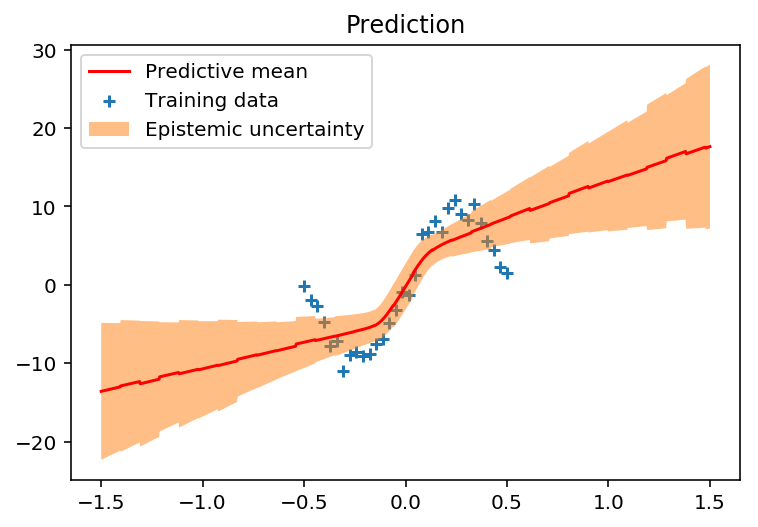
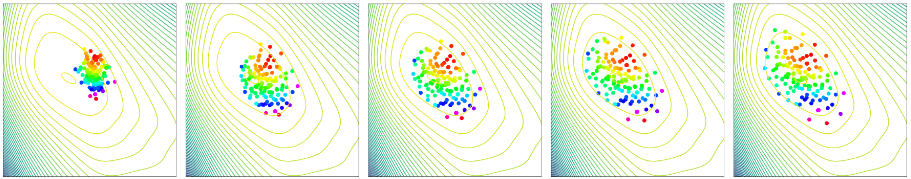
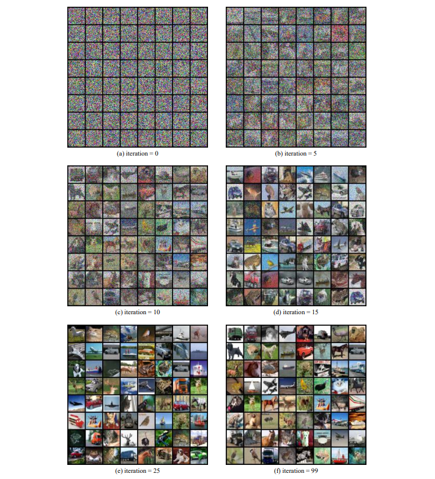

title: 采样与生成（1）：分布近似问题
description: 分布近似问题简介。
tags:
- 机器学习
- 贝叶斯学习
- 分布近似
---

## 分布近似问题

就本人目前所了解的现状，分布近似问题尚未在学界被严肃定义，多数研究者可能熟悉的是多年来持续火热的生成模型：生成对抗网络（Generative Adversarial Networks, GAN），扩散模型（Diffusion Model）等等。另一些核心却冷门的领域，如马尔科夫链蒙特卡洛采样（Markov Chain Monte Carlo, MCMC），或是变分推理（Variational Inference, VI），则极少成为人们热议的对象。实际上，MCMC与VI常常出现在生成模型的论文中，从远古时期的变分自编码器VAE，到Energy-based、基于Score Matching的生成模型，再到近两年火热的扩散模型（Diffusion Model），甚至生成对抗网络（GAN）都可以被解释为使用特殊kernel的VI。另一方面，起始于2016年的粒子变分推理法（Particle-based Variational Inference, ParVI）被逐步构建与MCMC、VI方法的联系，生成与采样逐渐被统一理解为求解分布近似问题。

### 问题定义

什么是分布近似问题呢？该问题可被定义为如下形式：

$$
\min_{\mu} \mathcal{F}(\mu, \nu), \tag{1}
$$

这里的$\mu$和$\nu$表示概率分布，$\mathcal{F}$表示一个度量，计算分布$\mu$和$\nu$之间的差异（不一定是距离），比如常见的KL散度（Kullback-Leibler Divergence），不常见的最大平均差异（Maximum Mean Discrepancy, MMD）和沃瑟斯坦距离（Wasserstein Distance）。

公式$(1)$定义了一个优化问题，优化目标是$\mathcal{F}(\cdot, \nu)$，或者写成$\mathcal{F}_{\nu}$，优化变量是一个分布$\mu$ ， 全局最优为另一个分布 $\nu$ 。也就是说，我们希望找到一个分布$\mu$在度量$\mathcal{F}$为判别标准的情况下接近分布$\nu$。

看起来，这个形式$(1)$非常接近我们熟知的实向量空间中的优化（熟悉凸优化的读者应该能很快get到联系）：

$$
\min_{x} F(x). \tag{2}
$$

比如在深度学习领域，优化目标$F$表示训练的损失函数, 优化变量$x$表示神经网络的参数。当然，神经网络的参数是逐层的，但是我们可以将其抽象表示为一个高纬度向量。此外，由于训练过程中输入的数据（集）不计算梯度，所以可以不把这些变量表示在公式$(2)$中。实际上在上述的表达中，数据集和网络结构共同定义了优化目标$F$。

看起来，公式$(1)$可类比作公式$(2)$的“升级”形式:

- 优化目标$F$计算两个**向量**之间的差异$\to$优化目标$\mathcal{F}$计算两个**分布**之间的差异。
- 优化变量$x$是一个**实向量**$\to$优化变量$\mu$是一个**概率分布**。 

### 贝叶斯学习

> 那么表达式$(1)$也可以按照上述神经网络的方式来理解吗？

实际上，如果从训练神经网络的角度阐释$(1)$， 我们可以非常方便地理解**贝叶斯学习**。首先回顾贝叶斯学习的基础——贝叶斯公式，建模了后验、似然、先验之间的关系：

$$
p(x|y) = \frac{p(y|x)p(x)}{p(y)}.
$$

假设现在使用贝叶斯公式建模一个分类任务的神经网络参数$x$的后验分布，则有：

$$
p(x|\mathcal{D}_{train}) = \frac{p(\mathcal{D}_{train}|x)p(x)}{p(\mathcal{D}_{train})},
$$

这里使用$\mathcal{D}_{train} = \{d_{train, j}\}^N_{j=1}$表示训练数据集（为了表达简洁就不再拆分为输入和输出了），上述公式可进一步表达为：

$$
p(x| \mathcal{D}_{train} ) \propto \prod^N_{j=1}{p( d_{train, j} |x)}p(x), \tag{3}
$$

上式表达了在给定训练数据集的情况下，神经网络参数的后验**分布**，可以被建模为**每一条输入数据的似然函数的乘积**，再乘上模型参数的先验分布$p(x)$。通常似然函数的形式比较复杂（由神经网络决定），先验分布形式简单，例如高斯分布。再推导一步，可得：

$$
-\log{p(x|\mathcal{D}_{train})} = -\left(\sum^{N}_{j=1}\log{p(d_{train, j}|x)} + \log{p(x)}\right).
$$

显然，等式右边就是常见的分类任务的损失函数，其中加号左边可以是`BCE`、`CE`这种，加号右边可以是`L1`、`L2`正则化。如果按照优化的思路，找到一个神经网络的参数$x$使得 $-\log{p(x|\mathcal{D}_{train})}$ 最小，我们就找到了当前训练集上的一个最优模型，神经网络的推理过程就是再次计算似然函数：

$$
p(d_{test}|\mathcal{D}_{train}) = p(d_{test}|x^*), \quad \text{where} \quad x^* = \arg\min_{x} -\log{p(x|\mathcal{D}_{train})}. \tag{4}
$$

**然而对于贝叶斯学习，或者说贝叶斯推理，推理过程被建模为**：

$$
\begin{align*}
    \begin{split}
    p(d_{test}|\mathcal{D}_{train}) 
    & = \int \underbrace{p(d_{test}| x)}_{prediction} \frac{\overbrace{p(\mathcal{D}_{train}|x)}^{likelihood}\overbrace{p(x)}^{prior}}{\underbrace{p(\mathcal{D}_{train})}_{marginal}}\mathrm{d}x \\
    & = \int \underbrace{p(d_{test}|x)}_{prediction}\underbrace{p(x|\mathcal{D}_{train})}_{posterior}\mathrm{d}x \\ 
    & = \mathbb{E}_{x \sim p(x|\mathcal{D}_{train})}\left[p(d_{test}|x)\right].
    \end{split} \tag{5}
\end{align*}
$$

对比式$(4)$和$(5)$，可以发现前者取当前训练集的最优的**一个**模型推理输出概率，而后者计算输出概率关于模型后验分布$\mathbb{E}_{x \sim p(x|\mathcal{D}_{train})}$的期望（当然也可以计算方差，建模输出结果的不确定度）。

这就是很多论文提到的：

1. 贝叶斯学习（推理）体现了模型输出的不确定度：单个预测结果$\to$预测结果的分布
2. 贝叶斯学习在少样本情况下不容易过拟合（此时贝叶斯学习的行为类似于集成学习，但一个显著的区别是，若损失函数的surface是凸的，那么集成学习的所有优化点都会坍缩到全局最优，但是贝叶斯学习的分布不会坍缩为狄拉克分布）。

上图是贝叶斯推理处理回归任务的一个简单示例，其中蓝色的点表示训练数据，红色的实线表示预测的平均值，橙色部分表示预测的方差（也是预测结果的不确定度）。可以看到，训练数据稀疏处预测不确定度较大，而训练数据密集处预测的不确定度较小。如果是一般的优化方法，则只有红线部分，没有橙色的预测不确定度部分（给定输入数据，一个模型只能给出一个预测结果）。

### 采样问题

> 如何计算贝叶斯推理$(5)$?

贝叶斯推理的目标计算式为：

$$
p(d_{test}|\mathcal{D}_{train}) = \mathbb{E}_{x \sim p(x|\mathcal{D}_{train})}\left[p(d_{test}|x)\right],
$$

其中模型参数的后验分布 $p(x|\mathcal{D}_{train})$ 与似然函数$p(d_{test}|x)$都是由神经网络建模的，意味着我们无法直接得到这个期望式的闭解（积分无法直接计算）。一个可行的替代方案是将`求期望`近似为`采样+求平均`：

$$
p(d_{test}|\mathcal{D}_{train}) \approx \frac{1}{M}\sum^M_{i=1}p(d_{test}|x_i), \quad where \quad x_i\sim p(x|\mathcal{D}_{train}).
$$

显然$p(d_{test}|x_i)$部分是可以计算的，这就是神经网络的`forward`过程，所以剩余的问题是如何从分布$p(x|\mathcal{D}_{train})$采样得到样本点$x_i$。这部分的难点在哪里呢？首先我们并不知道完整的概率密度函数$p(x|\mathcal{D}_{train})$，我们只能拿到一个正比的结论：

$$
p(x| \mathcal{D}_{train} ) \propto \prod^N_{j=1}{p( d_{train, j} |x)}p(x),
$$

这是因为边缘归一化参数 $p(\mathcal{D}_{train})$ 无法计算。其次，在只能拿到概率密度（和其梯度）的条件下，如何对这个分布采样？简单的高斯分布、beta分布等可以非常方便地调用现有的api得到样本点，但是 $p(x| \mathcal{D}_{train} )$ 显然不属于这种情况。

- 可以通过求积分的方式采样吗？No，$p(x| \mathcal{D}_{train})$形式复杂无法求积分
- 可以使用`拒绝采样`算法求解吗？No，我们无法得知$p(x| \mathcal{D}_{train})$的最大值
- 可以使用`重要性采样`算法求解吗？理论上是可以的，但是我们不知道分布$p(x| \mathcal{D}_{train})$的“形状”，无法构建合理的参考分布

此时再回顾分布近似问题的定义：

$$
\min_{\mu} \mathcal{F}(\mu, \nu),
$$

我们实际上想得到一个粒子点集合（或者说离散经验分布）$\tilde{\mu} = \{x_i\}^M_{i=1}$，使其尽可能接近目标分布 $\nu=p(x| \mathcal{D}_{train})$（先忽略度量$\mathcal{F}$的具体定义）。关于该问题，通常有如下三种求解方案（这些方法都需要计算$p(x| \mathcal{D}_{train})$的梯度，不过这一项是很好求解，一般可以通过反向传播计算）：

- 马尔科夫链蒙特卡洛（MCMC），尤其是2011年后发展的动力学MCMC方法
- 基于模型的变分推理（VI）
- 粒子变分推理（ParVI）

> - Bayesian Learning via Stochastic Gradient Langevin Dynamics
> - Auto-Encoding Variational Bayes
> - Stein Variational Gradient Descent: A General Purpose Bayesian Inference Algorithm

其中：

- VI参数化一个简单分布（比如高斯分布的均值和方差），将原优化变量$\mu$改为优化高斯分布的均值和方差，得以在实向量空间求解。在优化结束后，从这个简单的高斯分布抽取样本构建样本点集$\tilde{\mu} = \{x_i\}^M_{i=1}$。
- 由于简单分布结构上通常不足够灵活，VI方法的近似结果通常比较“粗糙”。ParVI则直接建模粒子点集$\tilde{\mu} = \{x_i\}^M_{i=1}$中每个粒子的位置，然后直接同时优化所有粒子点的位置，使粒子群近似目标分布。
- MCMC有三种形态：
  - 随机初始化一个粒子点，然后该粒子点按照某个规律做随机运动，搜集粒子点的运动轨迹，该轨迹的粒子点集合就是目标分布的采样结果
  - 随机初始化一群粒子点，这群粒子点按照某个规律做随机运动，迭代若干次后的粒子群状态即为目标分布的采样结果
  - 第一种和第二种形态可以混合使用

> 这里不详细讲三种算法的详细方案，可以参考上述论文或后续章节

三种算法的特性分别为：

- VI基于优化的方法，收敛快，扩展性好（优化结束后可生成任意多的样本点），但是近似精度低。
- ParVI同样基于优化方法，收敛快，近似精度高（粒子数量少的情况下通常远高于MCMC和VI），但是扩展性低（优化结束后无法再增加粒子点），单次迭代的计算复杂度高。
- MCMC基于随机游走，收敛慢，扩展性好，近似精度随着粒子点数量的增加而增加，但在少量粒子情况下精度差（随机性太高）。

上图是一个ParVI迭代过程（从左至右）的典型示例（二维分布近似），我将粒子点标上了颜色，可以更清楚观察到粒子点的移动轨迹。背景的等高线表示目标分布的概率密度。

### 生成模型

采样问题的设定中，目标分布$\nu$是连续分布，对空间中的点$x$可计算该处的概率密度函数$\nu(x)$。而分布近似问题的另一种设定，目标分布为离散经验分布（用$\tilde{\nu}$表示），此时目标分布的概率密度函数不可知，$\tilde{\nu}$表示为$N$个粒子点$\{y_j\}^N_{j=1}$（有权重的情况下表示为$\{(\beta_j,y_j)\}^N_{j=1}$），此时分布近似问题可看作以度量$\mathcal{F}$为损失函数的拟合问题。

> 分布近似问题与生成模型的联系是什么？

以CV的生成模型为例，这些模型的目标是将随机的高斯噪声样本$z$转化为图像$\tilde{x}$，并且希望生成的图像$\tilde{x}$接近真实图像$x$。我们假设模型参数可以用符号$\theta$表示，由网络参数化的“生成”分布可表示为$p_\theta(x)$。总而言之，这些符号的意义如下：

- $\tilde{\nu}$表示目标分布，也就是训练的数据集，包含了多张真实图像。
- 随机高维噪声用$z$表示。
- 神经网络的参数用$\theta$表示，随机噪声$z$可以通过神经网络转化为图像$\tilde{x}=f_\theta(z)$。
- 由神经网络参数化的“生成分布”表示为$p_\theta(x)$。

> 这里有一点符号混淆的问题是我们同时用$x$表示实向量空间中的点以及真实图像，而用$\tilde{x}$仅表示生成图像，但是应该比较好理解。

> 什么是参数化的“生成分布”呢？这里生成网络的作用是将高斯分布的噪声转化为图像，也就是说生成的图像实际上来自于某个未知的分布，由于大多数的神经网络（除了特殊设计的Flow Model）是不可逆的，这个生成的分布无法计算概率密度函数，我们能得到的仅仅只有通过神经网络生成的“真实”图像样本。这里仅仅是把这个未知分布用数学符号$p_\theta(x)$表示。

接下来我们以VAE（变分自编码器）为例，介绍如何推导出VAE的优化目标。首先我们从分布近似问题的定义出发：

$$
\min_\theta{\mathcal{F}(p_\theta, \tilde{\nu})},
$$

上式表达的意思是：优化一个神经网络，使得网络参数化的分布$p_\theta$接近目标分布$\tilde{\nu}$（真实图像），进而使生成的图像接近真实图像。具体来说，VAE使用的度量$\mathcal{F}$是$KL$散度：

$$
\begin{align*}
&\min_\theta{KL(\tilde{\nu} \| p_\theta)}\\
\Rightarrow & \min_\theta \int{\log{\frac{\tilde{\nu}}{p_\theta}}\mathrm{d}\tilde{\nu}} \\
\Rightarrow & \max_\theta \int{\log{p_\theta}\mathrm{d}\tilde{\nu}} \\ 
\Rightarrow & \max_\theta \mathbb{E}_{x \sim \tilde{\nu}}\left[\log{p_\theta(x)}\right], 
\end{align*}
$$

上式就是VAE（也包括了早期的diffusion model）使用的“极大似然”损失函数（优化目标）。

关于$\log{p_\theta(x)}$，进一步可得：

$$
\begin{align*}
p_\theta(x) &= \int{p_\theta(x|z)p(z)\mathrm{d}z} \\
&= \frac{p_\theta(x|z)p(z)}{p_\theta(z|x)}\\
&= \frac{p_\theta(x|z)p(z)q_\phi(z|x)}{p_\theta(z|x)q_\phi(z|x)}
\end{align*}
$$

> 这里的$q_\phi(z|x)$和$p_\theta(z|x)$的含义相似，可以看作是不同神经网络参数化的后验分布。熟悉VAE的读者应该可以看出$p_\theta(z|x)$是“未知的”编码器，$q_\phi(z|x)$是实际使用的近似编码器，$p_\theta(x|z)$是解码器。

对等式两边求对数可得：

$$
\begin{align*}
\log{p_\theta(x)} &= \log{\frac{p_\theta(x|z)p(z)q_\phi(z|x)}{p_\theta(z|x)q_\phi(z|x)}} \\
&= \log{\frac{p_\theta(x|z)p(z)}{q_\phi(z|x)}} - \log{\frac{p_\theta(z|x)}{q_\phi(z|x)}}
\end{align*}
$$

等式两边乘$q_\phi(z|x)$然后对$z$求积分可得：

$$
\begin{align*}
\int{q_\phi(z|x)\log{p_\theta(x)}\mathrm{d}z} &=  \int{q_\phi(z|x)\log{\frac{p_\theta(x|z)p(z)}{q_\phi(z|x)}}\mathrm{d}z} - \int{q_\phi(z|x)\log{\frac{p_\theta(z|x)}{q_\phi(z|x)}}\mathrm{d}z}
\end{align*}
$$

注意到$\log{p_\theta(x)}$与积分变量$z$无关，可得：

$$
\begin{align*}
\log{p_\theta(x)} &=  \int{q_\phi(z|x)\log{\frac{p_\theta(x|z)p(z)}{q_\phi(z|x)}}\mathrm{d}z} - \int{q_\phi(z|x)\log{\frac{p_\theta(z|x)}{q_\phi(z|x)}}\mathrm{d}z}\\
&= \underbrace{\mathbb{E}_{z\sim q_\phi(z|x)}\left[\log{\frac{p_\theta(x|z)p(z)}{q_\phi(z|x)}}\right]}_{ELBO} + KL\left(q_\phi(z|x) \| p_\theta(z|x)\right), 
\end{align*}
$$

上述过程就是ELBO（Evidence Lower BOund）的数学推导，注意到KL散度的结果一定是非负的，因此有：

$$
\log{p_\theta(x)} \geq \mathbb{E}_{z\sim q_\phi(z|x)}\left[\log{p_\theta(x|z)p(z) - \log{q_\phi(z|x)}}\right]
$$

整理公式，可得如下的优化目标：

$$
\max_{\theta, \phi} \mathbb{E}_{x\sim \tilde{\nu}}\left[ \mathbb{E}_{z\sim q_\phi(z|x)}\left[\log{p_\theta(x|z)p(z) - \log{q_\phi(z|x)}}\right] \right]
$$

实际上，VAE和diffusion model的优化目标就是上式，VAE用神经网络建模编码器$q_\phi(z|x)$，用一个神经网络建模解码器$p_\theta(x|z)$，diffusion用随机过程建模编码器，并且将解码过程建模为多步神经网络的forward过程。

> 那么生成对抗网络GAN也可以表达成类似的形式吗？

在2014年发表的最初的GAN论文中可以找到作者对GAN优化目标的数学理解，实际上，GAN最小化参数分布$p_\theta$和目标分布$\tilde{\nu}$之间的$JS$散度（假设判别器以训练到最优）：

$$
\min_\theta KL\left(\tilde{\nu} \left\| \frac{\tilde{\nu} + p_\theta}{2} \right. \right) + KL\left(p_\theta \left\| \frac{\tilde{\nu} + p_\theta}{2} \right. \right).
$$
 
除了`Vanilla GAN`，还有`Wasserstein-GAN`，`MMD-GAN`，`Sinkhorn-GAN`等等，这些都可以用：

$$
\min_\mu{\mathcal{F}(\mu, \tilde{\nu})}
$$

表达，区别在于生成分布$\mu$的定义形式和使用的度量$\mathcal{F}$不同。

> - Wasserstein GAN
> - MMD GAN: Towards Deeper Understanding of Moment Matching Network
> - Learning Generative Models with Sinkhorn Divergences

最后，粒子变分推理法可以直接计算离散经验分布$\tilde{\mu}$，使其近似真实图像分布$\tilde{\nu}$。这个过程可以没有网络，ParVI可以直接计算出每个噪声平滑地变换为图像的过程，当然也可以用神经网络拟合这个过程，这也是2022年末很多diffusion模型的做法，这里我们不讨论详细的数学过程。

> 代码可参考：https://github.com/lzj-isee/dpvi_discrete。

上图是ParVI方法在cifar10数据集上的一个简单实验结果。